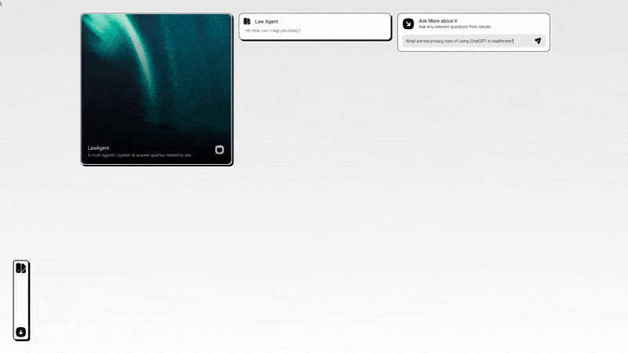
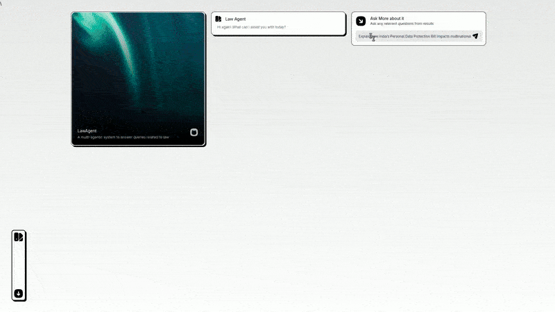
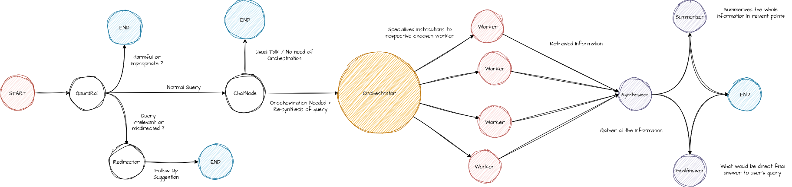
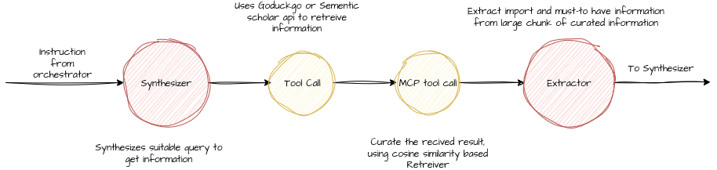

<div align="center" ></div>
<div align="center">
  


</div>

# News & Law Agent
<div align="center">
  <a href="https://www.youtube.com/watch?v=Aj6uJ9t6-YA">
    
  </a>
  
</div>

<div align="center">
  Click to view Demo video on youtube
</div>

---

### Features
<div align="center">
  
| Autonomous Task Completion                                       | Card-wise Output Arrangement                           | Error & Guardrail Handling                            |
| ---------------------------------------------------------------- | ------------------------------------------------------ | ----------------------------------------------------- |
|  |  |  |

</div>

# Architecture

### Agentic Workflow
<div align="center">
  
</div>
I am using NeoVIm in my text 
<hr>

### **Initial Query Processing**

The process begins with the **Start** node, which represents a user submitting a query. From there, the query goes to a **Gaurdrail**. This is a crucial first step where the system decides what kind of query it is and how to handle it.

* **Normal Query**: If the query is straightforward or good to go, it's routed to the **ChatNode**.
* **Query Irrelevant or Misdirected**: If the query is off-topic, nonsensical, or can't be handled by the system, it's sent to a **Redirector**. This node might suggest a new way to phrase the query or provide a canned response, leading to an **End** state.
* **Harmful or Inappropriate**: For queries that violate safety guidelines (e.g., are malicious, toxic, or unethical), the **Gaurdrail** ends the flow, also leading to an **End** state.

---

### **Orchestration and Information Retrieval**

If the query is a "Normal Query," it arrives at the **ChatNode**. Here, the system makes another decision:

* **User Task / No Need of Orchestration**: For simple requests that can be answered directly by the LLM without external information, the query bypasses the **Orchestrator** and proceeds to the **End** with its response.
* **Orchestration Needed / Re-synthesis of Query**: For complex questions that require external data or multiple steps, the query is passed to the **Orchestrator**. The **Orchestrator** is the brain of the system, responsible for planning and coordinating the work.

The **Orchestrator** takes the complex query and creates "specialized instructions" for a group of **Workers**. These **Workers** are agents specialized in specific tasks
The **Workers** retrieve the requested information and send it back as "Retrieved Information" to the **Synthesizer**. 

---

### **Synthesis and Final Output**

The **Synthesizer** is where all the retrieved information comes together. It gathers the data from the **Workers** and combines it with the original query to create a coherent response. It then sends this synthesized information to the **Final Answer** node and a **Summarizer** node.

* **Final Answer**: This node is responsible for generating a direct and concise answer to the user's initial query based on the synthesized information. This is the primary output the user sees.
* **Summarizer**: This node creates a high-level summary of the wide range of information that was gathered, providing a more comprehensive overview if needed.

Both the **Final Answer** and the **Summarizer** then lead to an **End** state, completing the entire process. This dual output provides both a quick, direct response and a more detailed, summarized one, offering a richer user experience.
# 
### Workers
<div align="center">
  
</div>

---

### **1. Synthesizer**

This first step is triggered by an "instruction from the orchestrator," which asks for specific information. The **Synthesizer**'s job here is to take that high-level instruction and "synthesize a suitable query." This means it translates the human-like request into a precise, JSON query that can be used by an external tool. 

---

### **2. Tool Call**

Once the query is ready, it goes to the **Tool Call** node. This node represents the action of using an external API or tool to retrieve information. This system specifically uses the **DuckDuckGo** or **Semantic Scholar API**.

---

### **3. MCP Tool Call**

This step represents a process of "curating the received result" using a "cosine similarity-based Retriever." Here the received information from tool call goes to deployed MCP server which uses embedding model to generate embedding of information and result the index of those document that are relvent to the Orchestrator instruction.

---

### **4. Extractor**

Finally, the curated information is sent to the **Extractor**. This node's purpose is to "extract important and must-have information" from the prepared data. This is where the system gets down to the specifics, pulling out key facts, and conclusions.

The output of the **Extractor** is a concise and highly relevant set of data that is then sent to the final **Synthesizer** (from the first diagram) to be combined with other information and formulated into the final user-facing answer.

## Project Structure
```
LawAgent > 
Backend
├── __pycache__/                           
│   └── app.cpython-312.pyc
│
├── app.py                                 # Main FastAPI entrypoint for the Law & News Agent
├── Dockerfile                             # Docker build file for production deployment
├── requirements.txt                       # Project dependencies for the entire agentic system
├── lawAgent/                              # Core Agentic system (agents, nodes, routing, tools)
│   ├── __init__.py
│   ├── agent.py                            # Master Agent or Orchestrator entry point (Enseble point)
│   │
│   ├── Nodes/                              # All nodes used inside LangGraph workflow
│   │   ├── __init__.py
│   │   ├── example.py                      # Demo node (used for tests )
│   │   ├── final.py                        # Final answer synthesis node
│   │   ├── gaurd.py                        # Safety, moderation, rule-based filtering
│   │   ├── gov.py                          # Government laws & legal news query node
│   │   ├── media.py                        # Image-based query node
│   │   ├── orchestrator.py                 # Orchestrator node (routing logic)
│   │   ├── redirector.py                   # Redirect to follow up during any irrelvent query
│   │   ├── researcher.py                   # Fetches Research article
│   │   ├── retreiver.py                    # News/Articles retreiver
│   │   ├── state.py                        # LangGraph state schema
│   │   ├── summerizer.py                   # Summarization node for retrieved documents
│   │   │
│   │   ├── prompts/                        # Prompt templates for each node
│   │   │   ├── conversation.txt
│   │   │   ├── finalanswer.txt
│   │   │   ├── gaurd.txt
│   │   │   ├── gov_synthesizer.txt
│   │   │   ├── image_synthesizer.txt
│   │   │   ├── orchestrator.txt
│   │   │   ├── redirection.txt
│   │   │   ├── research_synthesizer.txt
│   │   │   ├── retriver_synthesizer.txt
│   │   │   └── summerizer.txt              
│   │   │
│   │   ├── tools/                          # External information tools (APIs, scrapers)
│   │   │   ├── __init__.py
│   │   │   ├── gov.py                      # GoDuckGo API fetch for official gov cites
│   │   │   ├── images.py                   # GoDuckGo API fetch for media
│   │   │   ├── mcp_client.py               # MCP (Model Context Protocol) tool client
│   │   │   ├── news.py                     # GoDuckGo API fetch for News and articles
│   │   │   └── sementicScholar.py          # Semantic Scholar API fetch for research articles
│   │   │
│   │   └── utils/                          # Utility functions shared across nodes
│   │       ├── __init__.py
│   │       └── utils.py                    # Common helpers, formatting, normalization
│   │
│   └── __pycache__/                        
│
└── Notebooks/                              # Experimentation, prototyping, and debugging

```
---
